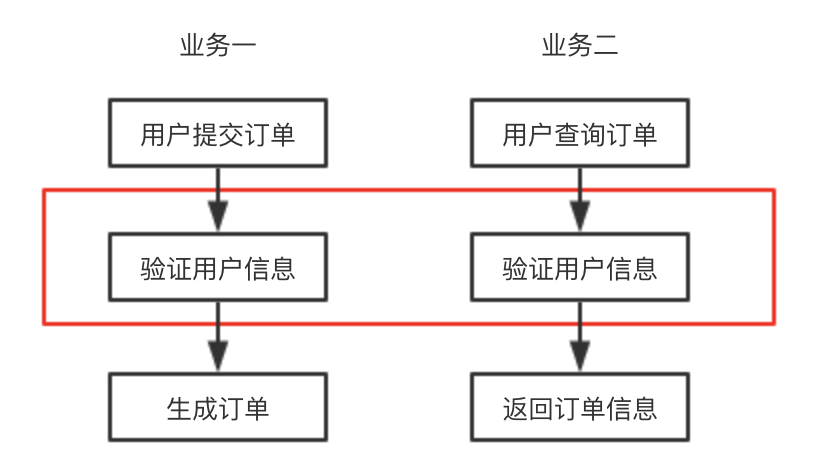
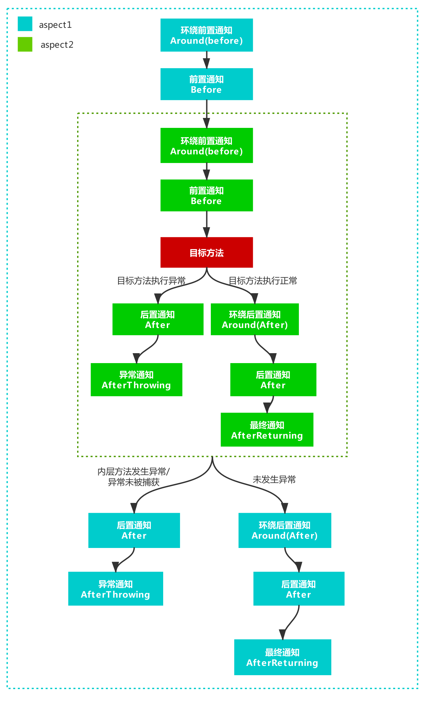

# 面向切面（AOP）

AOP(Aspect Oriented Programming)面向切面编程是与OOP(Object Oriented Programming)面向对象编程并列的编程思想。相对于IOC(依赖注入)而言，AOP是一种可以在不修改源代码的情况下给程序动态添加功能的一种方式。

使用AOP可以对业务逻辑的各个部分进行隔离，从而使得业务逻辑各部分之间的耦合度降低，提高程序的可重用性，同时提高了开发的效率。

## 什么是切面(Aspect)

AOP名为面向切面编程，所以切面(Aspect)是AOP中一个很关键的点。

比如假设我们有一个订单系统，有如下两条线的功能，提交订单和查询订单，每个事件流都需要执行“验证用户信息”的操作，将这个功能框起来后，你可以把它当块板子，这块板子插入了一些控制流程，这块板子就可以当成是AOP中的一个切面。



## 如何创建Aspect

在Uma中定义一个Aspect需要遵循以下几点规范：
1. 框架会扫描`${URSA_ROOT}/aspect`目录下的文件读取Aspect，所以，所有的Aspect文件都必须放在`app/aspect`目录下，支持多级目录
2. 所有Aspect文件的命名需要按照`名称.aspect.ts`的格式，以`.aspect.ts`为后缀名，使用时Aspect的名称会取.aspect前的文件名
3. Aspect类需要实现`IAspect接口`

例如，我们在`${URSA_ROOT}/aspect`目录下创建一个`test.aspect.ts`：

```javascript
// app/aspect/test.aspect.ts

import { IAspect, IJoinPoint } from '@umajs/core';

export default class Test implements IAspect {
    before(point: IJoinPoint) {
        console.log('index: this is before:', point.target);
    }
}

```

该方法实现了一个切面，切面定义了前置通知方法，我们会在下面介绍通知

## 通知

`通知`是 AOP 中一个很重要的概念，所谓通知指的就是在拦截到方法之后要执行的代码。通知分为前置(before)、后置(after)、异常(afterThrowing)、最终(afterReturning)、环绕(around)通知五类。

- 前置通知：在目标方法之前执行
- 后置通知：在目标方法之后执行
- 异常通知：当执行目标方法出现异常时调用
- 最终通知：当目标方法有返回值之后执行，在后置通知之后
- 环绕通知：在最开始调用时执行，会将目标方法作为参数传入，对目标方法(proceed)及入参(args)、出参(result)进行拦截，此方法必须返回 Result

在 Uma 中我们对这5个通知都做了实现，你需要先在aspect文件中定义这些通知，然后在controller中通过修饰器的方式使用它。

例如上面的`${URSA_ROOT}/aspect/test.aspect.ts`中我们定义了一个前置(before)通知，如果想再定义一个环绕(around)通知，可以这样修改：

```javascript
// ${URSA_ROOT}/aspect/test.aspect.ts

import { IAspect, IJoinPoint, IProceedJoinPoint, Result } from '@umajs/core';

export default class Test implements IAspect {
    before(point: IJoinPoint) {
        console.log('index: this is before:', point.target);
    }
    // ====> 创建环绕通知
    async around(proceedPoint: IProceedJoinPoint) {
        const { proceed, args } = proceedPoint;
        console.log('index: this is around before');

        // 判断登录，还可以做其他判断逻辑等等
        if (!isLogin) return Result.redirect('/login');

        // args 为参数，可以对参数进行判断、修改等等操作
        const result = await proceed(...args);
        console.log('index: this is around after');
        return result;
    }
}
```

然后在`${URSA_ROOT}/controller/index.controller.ts`中使用它

```javascript
// ${URSA_ROOT}/controller/index.controller.ts

import {  BaseController, Path, Aspect } from '@umajs/core';

export default class Index extends  BaseController {
    // ===> 在这里使用
    @Aspect.around('test')
    index() {
        return this.view('index.html', { name: 'Abc123' });
    }

    @Aspect('test')
    @Path('/test')
    test() {
        return this.json({ test: 1 });
    }
}
```

这样你在访问Index/index方法时，会先执行`${URSA_ROOT}/aspect/test.aspect.ts`中的around方法，index方法被框架封装后作为参数传给around通知方法

一个完整的Aspect切面

```javascript
import { IAspect, IJoinPoint, IProceedJoinPoint } from '@umajs/core';

export default class Method implements IAspect {
    before(point: IJoinPoint) {
        // 前置通知
    }
    after(point: IJoinPoint) {
        // 后置通知
    }
    async around(proceedPoint: IProceedJoinPoint) {
        const { proceed, args } = proceedPoint;
        // 环绕通知before
        return await proceed(...args);
        // 环绕通知after
    }
    afterThrowing(e: Error) {
        // 异常通知
    }
    afterReturning(point: IJoinPoint, result: any) {
        // 返回通知
    }
}
```

其中`IJoinPoint`和`IProceedJoinPoint`类型声明为

```javascript
export interface IJoinPoint {
    target: Object;
    args: Array<any>;
}

export interface IProceedJoinPoint extends IJoinPoint {
    proceed: Function;
}
```

一个目标上可以作用多个Aspect，多个Aspect的执行顺序为包裹型，具体执行顺序见下图：



## @Aspect修饰器

在Uma中，通过修饰器`@Aspect`的方式使用Aspect

### 1. 作用点

`@Aspect`修饰器可以作用在某个controller的`class`上或者controller的`某个方法`上

```javascript
// 作用在class上
@Aspect('test1')
export default class Index extends  BaseController {
    // 作用在方法上
    @Aspect('test2')
    index() {
        return this.send('这里是首页');
    }
}
```

作用在Class上的Aspect会被应用于Class的所有方法上

### 2. 语法

`@Aspect`修饰器有两种语法形式
- 对目标使用Aspect中的所有通知：**@Aspect('xx')**
- 对目标使用Aspect中指定通知：**@Aspect.before('xx')、@Aspect.after('xx')、@Aspect.afterThrowing('xx')、@Aspect.afterReturning('xx')、@Aspect.around('xx')**

```javascript
export default class Index extends  BaseController {
    // 所有通知
    @Aspect('test1')
    // 指定只生效前置
    @Aspect.before('test2')
    // 指定只生效环绕
    @Aspect.around('test2')
    index() {
        return this.send('这里是首页');
    }
}
```

> 注意1：around 方式可以修改被修饰方法的入参和出参，因此在部分场景返回值需要特别注意，例如在修饰 controller 方法时，未返回或者返回值类型不是 Result 时可能会提示出错。
>
> 注意2：afterThrowing 会捕获并拦截错误，如果不将错误抛出，上层将不会捕获错误。

### 中间件转环绕使用

[Middleware 参考文档](./Middleware.html#aop-装饰器形式)

