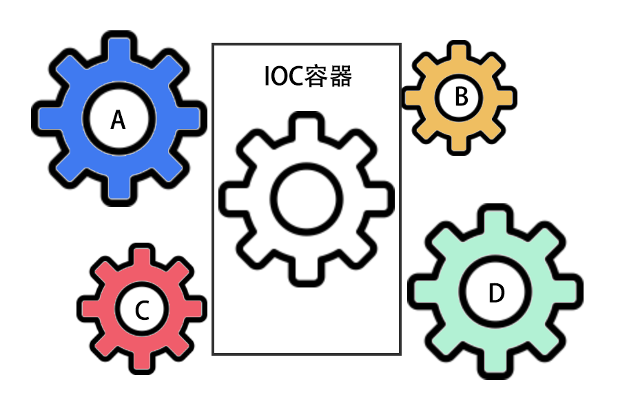

# IOC

IOC(Inversion of Control)控制反转，是面向对象编程中的一种设计原则，可以用来减低计算机代码之间的耦合度。

## 什么是IOC

`控制反转(Inversion of Control)`是一种借助于`第三方容器`，实现对具有依赖关系的`对象之间解耦`的一种`代码设计思路`。

例如我们的程序中有对象A、B、C、D像齿轮一样相互依赖的运作着，如下图：


我们可以看到，在这样的齿轮组中，如果有一个齿轮出了问题，就可能会影响到整个齿轮组的正常运转。

为了解决对象之间的耦合度过高的问题，软件专家Michael Mattson提出了IOC理论，借助于“第三方容器”实现对象之间的解耦，如下图：



由于引进了中间位置的“第三方容器”，也就是`IOC容器`，使得A、B、C、D这4个对象没有了耦合关系，齿轮之间的传动全部依靠“第三方容器”了，全部对象的控制权全部上缴给“第三方”IOC容器。

当对象A需要用到对象B的时候，只需要通过IOC容器来获取`对象B的实例`，而不需要自己创建一个对象B实例。而IOC容器又通过`依赖注入`的方式将对象A需要的对象B实例`注入`到对象A中。


## @Resource、@Inject修饰器

Ursa提供了`@Resource修饰器`和`@Inject修饰器`来实现`IOC容器`和`依赖注入`

@Resource修饰器可以修饰`${URSA_ROOT}中的任意class`，被@Resource修饰的class，将会在IOC容器中加入一个该`class的实例`

@Inject修饰器可以将`被@Resource修饰过`的class的`实例`注入到指定变量中

例如，我们在`${URSA_ROOT}/model`中创建一个`user.model.ts`，并使用@Resource将该类实例化后加入到资源容器中

```javascript
import { Resource } from '@ursajs/core';
import { BaseModel } from '@ursajs/plugin-model';
import { DataTypes } from 'sequelize';

// ===> @Resource修饰器
@Resource()
export default class UserModel extends BaseModel {
    static tableName = 'user';
    static setting={
        freezeTableName: true,
        tableName: UserModel.tableName,
        timestamps: false,
    };
    static fields = {
        id:{
            type:DataTypes.STRING,
            autoIncrement: true,
            primaryKey: true,
        },
        name: DataTypes.STRING,
        sex: DataTypes.STRING
    };
}
```

然后我们可以在controller中获取该model实例

```javascript
import { BaseController, Path, Private, Param, Query, RequestMethod, Inject, Aspect } from '@ursajs/core';
import UserModel from '../model/user.model'

export default class Index extends BaseController {

    // ===> 获取实例，实例的名称为@Resource修饰的class所在的文件名
    @Inject('user')
    user: UserModel;

    async testModel() {
        // ===> 这里不需要创建user实例，@Resource已经将userModel实例化保存在容器中
        const userList = await this.user.findAll();
        return this.json(userList);
    }
}
```

@Resource可以对`任何class进行修饰`，即任何资源都可以加入到容器中，然后通过依赖注入的方式使用。

`@Resource修饰器支持传入参数`，传入的参数将会被作为修饰类实例化时的`构造参数`使用。

## @Service修饰器
除了提供的 Resource 和 Inject 装饰器，还有一个特殊的依赖注入装饰器 Service，Service 装饰器仅提供  BaseController 使用，为了方便使用，Service 注入中内置了 ctx，框架默认将`${URSA_ROOT}/service`下的文件实例化加入到`service的容器中`，当我们使用的时候，通过`@Service修饰器`去获取该实例。

```javascript
import DemoService from '../service/demo.service';

export default class Index extends  BaseController {

    @Service('demo')
    demoService: DemoService

    @Path('/demo')
    demoService() {
        // return this.demoService.loadAll();
    }
}
```

```javascript
import { BaseService } from '@ursajs/core';

export default class Demp extends BaseService {
    loadAll() {
        // return
    }
}
```

> @Service和@Resource最大的不同是，在@Service修饰的方法中可以访问到`ctx`上下文对象，而@Resource没有

### 在非 Controller 中使用 Service 时，必须传入 ctx 进行实例化才能使用。

[参考文档](./Service.html)

