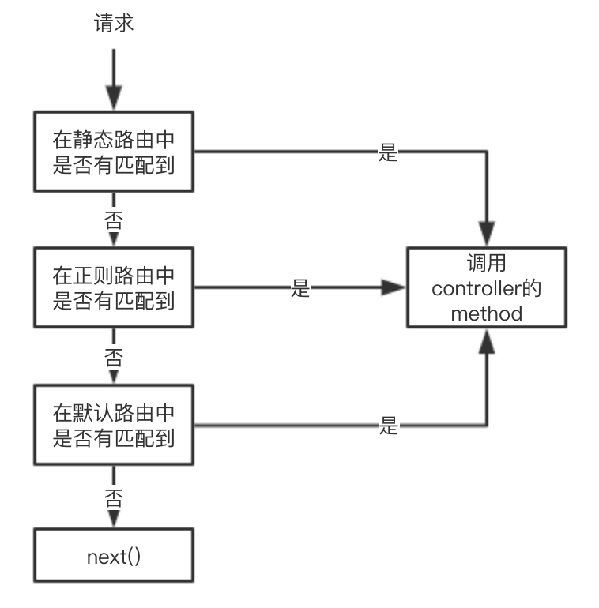

# 路由（Router）

路由主要用于确认如何响应客户端的请求，当用户访问一个地址时，需要找到指定的controller的指定方法对用户请求进行处理。确认一个请求主要对请求的两部分：路径和特定HTTP请求方法，进行判断。

## 使用

为了方便用户对路由的选择，Router被作为参数的方式传入到Uma中。

```javascript
import { Router } from '@umajs/router';

const uma = Uma.instance({
    Router,
    ROOT: __dirname
});

uma.start(8058);
```

## 默认路由

在`Uma`中默认所有controller的`所有方法`都可以被`任何请求方式`访问到，访问的地址为`/${controller名称}/${方法名称}`，我们对这种路由称之为`默认路由`。

例如在`${URSA_ROOT}/controller`目录下创建一个`test.controller.ts`：

```javascript
// ${URSA_ROOT}/controller/test.controller.ts
import { BaseController } from '@umajs/core';

export default class Test extends BaseController {
    index() {
        return this.send('this is test/index router');
    }
}
```

在浏览器地址栏通过访问`127.0.0.1:端口号/test/index`就可以看到页面显示出`this is test/index router`。

## @Path修饰器

如果你不想通过默认路由的方式访问时，`Uma`提供了`@Path修饰器`来指定controller方法被访问的URI格式。

>可以装饰 class，作为跟路由，只装饰 class 不生效，必须和 method 装饰配合使用。装饰 class 只有能有一个 string 参数
>可以装饰 method，没有根路由的时候直接作为路由使用，有根路由的时候和根路由组合使用
>
>export declare function Path(...args: [...string[]] | [TPathObjArgs]): Function;
>
>args 路由参数 eg:
>
>Path('/p1')
>
>Path('/p1', 'p2')
>
>Path({ value: '/p1' })
>
>Path({ value: '/p1', method: RequestType.GET })
>
>Path({ value: ['/p1', '/p2'], method: RequestType.GET })
>
>Path({ value: ['/p1', '/p2'], method: [RequestType.GET, RequestType.POST] })

### 修饰class

@Path修饰器除了能修饰方法外，还可以修饰controller的class，被修饰后的class，如果内层的方法同时也添加了@Path修饰器，那么该方法的访问路径将和class上的@Path指定路径合并使用。

例如我们对上面创建的test.controller.ts文件做以下修改：

```javascript
import { BaseController, Path } from '@umajs/core';

@Path('/page')		// 根路由
export default class Test extends BaseController {
    @Path('/home')
    index() {
        return this.send('this is test/index router');
    }
}
```

在浏览器地址栏通过访问`127.0.0.1:端口号/page/home`就可以看到页面显示出`this is test/index router`。

> 注意：作用在class上的@Path不会影响默认路由，只会和方法上的@Path修饰器合并使用，即在浏览器地址栏通过访问`127.0.0.1:端口号/test/test`可以看到页面显示出`this is test/test router`，但输入`127.0.0.1:端口号/page/test`会返回Not Found。

### 修饰方法

例如我们对上面创建的test.controller.ts文件做以下修改：

```javascript
export default class Test extends BaseController {

    @Path('/home')
    index() {
        return this.send('this is test/index router');
    }
}
```

在浏览器地址栏通过访问`127.0.0.1:端口号/home`就可以看到页面显示出`this is test/index router`，通过@Path修饰器修饰过的方法访问时地址不加 Controller 名，即不是`/test/home`而是`/home`。

> 注意：此时，在浏览器地址栏访问`127.0.0.1:端口号/test/index`就不能访问到index方法了，因为在`Uma`中，被@Path修饰器修饰过的方法，不能再通过默认路由的方式访问。

### MethodType
在很多访问中，我们需要加入 MethodType 的限制，示例如下：
```javascript
export default class Test extends BaseController {

    @Path({ value: '/home', method: RequestType.POST })
    index() {
        return this.send('this is test/index router');
    }
}
```
在浏览器地址栏通过访问`127.0.0.1:端口号/home`会展示 NOT FOUND，这是因为限制了只能采用 POST 访问。

> 注意：框架内置了 POST 请求处理 `koa-body`，如果需要开启，实例化 `Uma` 时需要传入 `bodyParse` 参数，并且安装 `koa-body` 依赖

### 指定多个路径

同一个方法上允许设置多个Path路径。

例如我们对上面创建的test.controller.ts文件做以下修改：

```javascript
import { BaseController, Path } from '@umajs/core';

@Path('/page')
export default class Test extends BaseController {

    @Path('/home', '/abc')
    index() {
        return this.send('this is test/index router');
    }
}
```

在浏览器地址栏通过访问`127.0.0.1:端口号/page/home`或者`127.0.0.1:端口号/page/abc`都可以看到页面显示出`this is test/index router`。

也可以通过多个@Path修饰器修饰的方式指定多个路径。

例如我们对上面创建的test.controller.ts文件做以下修改：

```javascript
import { BaseController, Path } from '@umajs/core';

@Path('/page')
export default class Test extends BaseController {

    @Path('/home', '/abc')
    @Path('/test')
    index() {
        return this.send('this is test/index router');
    }
}
```

在浏览器地址栏通过访问`127.0.0.1:端口号/page/home`或者`127.0.0.1:端口号/page/abc`或者`127.0.0.1:端口号/page/test`都可以看到页面显示出`this is test/index router`。

和方法不同，一个class只允许使用一个@Path修饰器，同时一个@Path修饰器只接收一个参数。

例如我们对上面创建的test.controller.ts文件做以下修改：

```javascript
import { BaseController, Path } from '@umajs/core';

@Path('/page')
@Path('/tpl')
export default class Test extends BaseController {
    @Path('/home', '/abc')
    @Path('/test')
    index() {
        return this.send('this is test/index router');
    }
}
```

此时，只有最上面的`@Path('/page')`生效了，因为修饰器会先执行最接近自己的，@Path('/tpl')先被作用，但是@Path('/page')又将它覆盖了。

同样，如果你在class上设置`@Path('/page', '/tpl')`这种传入多个参数的格式，程序会报错，因为修饰class时，@Path只接收一个参数。

### 正则匹配

我们对上面这种直接使用具体字符串形式设置的路由称为`静态路由`，路径除了使用`/home`这种字符串的格式外，还支持使用正则形式，我们称之为`正则路由`。

例如我们对上面创建的test.controller.ts文件做以下修改：

```javascript
import { BaseController, Path } from '@umajs/core';

@Path('/page')
export default class Test extends BaseController {

    @Path('/:name')
    index() {
        return this.send('this is test/index router');
    }
}
```

在浏览器地址栏通过访问`127.0.0.1:端口号/page/任意字符`都可以看到页面显示出`this is test/index router`。同时，我们可以通过`@Param修饰器`或者`ctx.params`的方式获取到当前`name`的值，@Param修饰器会在后面介绍。

正则路由通过[path-to-regexp](https://github.com/pillarjs/path-to-regexp)库进行匹配，具体格式格式参考path-to-regexp库。

### 匹配顺序

`Uma`会按照的指定顺序去匹配路由，当命中某一规则时，即进入该controller的方法中，了解匹配的顺序当我们设置了重复的路由时很有帮助。

`Uma`匹配路由的顺序如下：



请求进来时，会先从静态路由中查找是否有匹配到的，没有的话会从正则路由中匹配是否有满足的，还未找到的话会按照静态路由的格式查找是否有匹配的，当这几种情况都不满足时，返回Not Found。

## @Param、@Query修饰器

在上面的正则路由中我们提到过@Param修饰器，`Uma`中提供了两种修饰器@Param和@Query来方便的获取请求中的参数

例如我们对上面创建的test.controller.ts文件做以下修改：

```javascript
import { BaseController, Path } from '@umajs/core';

@Path('/page')
export default class Test extends BaseController {

    @Path('/:name')
    index(@Param('name') name: string, @Query('name') title: string) {
        console.log(`name: ${name}`);
        console.log(`title: ${title}`);
        return this.send('this is test/index router');
    }
}
```

在浏览器中访问`127.0.0.1:端口号/page/test?name=uma`，我们可以看到控制台打印出：

```shell
name: test
title: uma
```

@Param和@Query修饰器可以快捷的获取到请求中的param和query参数，@Param传入的名称要和@Path中设置的名称一致，@Query传入的名称要和请求的query参数名称一致，才能正确获取到。

同时，使用@Param和@Query修饰器不区分参数顺序

```javascript
- index(@Param('name') name: string, @Query('name') title: string)
// 参数顺序变化也可以正确获取
+ index(@Query('name') title: string, @Param('name') name: string)
```

当然，除了通过@Param和@Query修饰器的方式获取参数外，`Uma`还保留了koa的参数获取方式，可以从上下文中获取：

```javascript
import { BaseController, Path } from '@umajs/core';

@Path('/page')
export default class Test extends BaseController {

    @Path('/:name')
    index(@Param('name') name: string, @Query('name') title: string) {
        // ====> 从ctx中获取参数
        console.log(this.ctx.param.name);
        console.log(this.ctx.query.title);
        return this.send('this is test/index router');
    }
}
```

## @Private修饰器

`Uma`默认所有controller方法都可以被访问到，如果你不想某个方法被访问时，可以通过@Private修饰器修饰方法。

例如我们对上面创建的test.controller.ts文件做以下修改：

```javascript
import { BaseController, Path, RequestMethod } from '@umajs/core';

@Path('/page')
export default class Test extends BaseController {

    @Path('/:name')
    index(@Param('name') name: string, @Query('name') title: string) {
        // ====> 从ctx中获取参数
        console.log(this.ctx.param.name);
        console.log(this.ctx.query.title);
        return this.send('this is test/index router');
    }

    @Private
    test() {
        this.send('this is test/test router');
    }
}
```

此时，被@Private修饰过的test方法，不能再通过`/test/test`的方式访问到。


