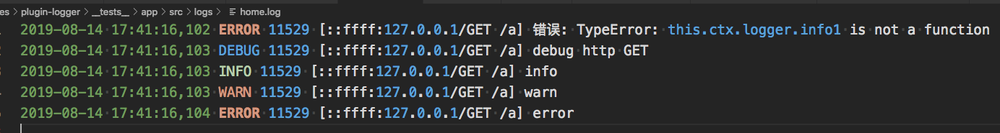

# Logger

## 日志
日志对于Web项目的运行状态、问题排查等都非常重要。框架的`@ursajs/logger`模块提供日志支持。并且提供`@ursajs/plugin-logger`模块，以插件的机制将logger实例绑定在ctx上，方便用户使用。

主要特性：
- 日志分级
- 统一错误日志，所有 logger 中使用 .error() 打印的 ERROR 级别日志都会打印到统一的错误日志文件中，便于追踪
- 自定义日志
- 自动切割日志

## 使用`plugin-logger`
`plugin-logger`插件将logger实例绑定在ctx上，因此可在项目中使用`this.ctx.logger`使用
- 安装插件 `npm install -S @ursajs/plugin-logger`
- 插件配置：

```javascript
//app/src/config/default/plugin.config.ts
import * as path from 'path';
export default function (app) {
    return {
        logger: {
            enable: true,
            options: {
                level: 'DEBUG', //日志输出级别
                file: path.resolve(app.options.URSA_ROOT, '../log/logger.log'),
                allowDebugAtProd: false, // 是否允许打印debug日志
            },
        },
    };
}
```

- logger打印

```js
//使用 app/src/controller/index.controller.ts
export default class Index extends Controller {
    @Path('/index')
    @RequestMethod('GET')
    index() {
        this.ctx.logger.info(this.testService.return1());
        this.ctx.logger.debug('debug');
        this.ctx.logger.warn('warn');
        this.ctx.logger.error('error');
        this.ctx.body = '这里是首页';
    }
}
```

## 使用UrsaLogger
`UrsaLogger`可单独使用，使用方式如下：

```js
import { UrsaLogger } from '@ursajs/logger';
import * as path from 'path';

const logger = new UrsaLogger({
    level: 'ALL',
    consoleLevel: 'ALL',
    encoding: 'utf-8',
    file: path.resolve(__dirname, '../log/logger.log')
});
logger.debug('debug');
logger.info('info GET');
logger.warn('warn');
logger.error('error');
```

## 日志配置

```javascript
exports.logger = {
    level: 'DEBUG', //日志输出级别
    dir: '/path/to/your/custom/log', //日志输出目录
    errorLogName: 'errorlogger.log', //error级别日志文件名
    infoLogName: 'infologger.log', //info级别日志文件名
    warnLogName: 'warnlogger.log', //warn级别日志文件名
    file: '/path/to/your/custom/log/logger.log', //日志文件写入路径(所有级别日志)
    encoding:'utf-8', //日志编码格式
    outputJSON:true, //是否格式化输出携带pid等信息 false仅输出msg
    consoleLevel:'debug', //终端日志输出级别
    allowDebugAtProd:true, //是否允许打印debug日志
    flushInterval: 1000, //文件流定时写入
    maxBufferLength: 1000, //最大buffer 超出限制执行写入
    formatter: function(meta?:TConsoleMeta) {
        return `[${meta.level} ${meta.pid}] ${meta.date} ${meta.hostname} ${meta.paddingMessage}: ${meta.message}`;
    }, //日志格式化输出
    splitTime: '00 00 * * * *' //日志文件切割时间
};
```

## 日志路径
1. 默认日志文件路径：默认都放在`${APP_ROOT}/log/logger.log`路径下；
2. 自定义日志文件路径：
`config.file`会把所有日志统一写入`file`所指定的文件中；

```javascript
// config/logger.config.ts
exports.logger = {
    file: '/path/to/your/custom/log/logger.log' //日志文件路径(所有级别日志统一写入)
};
```

3. 不同级别日志分开打印

日志按级别分开打印，需配置`config.dir config.errorLogName ...`

```javascript
// config/logger.config.ts
exports.logger = {
    dir: '/path/to/your/custom/log', //日志目录
    errorLogName: 'errorlogger.log', //error级别日志文件名
    infoLogName: 'infologger.log', //info级别日志文件名
    warnLogName: 'warnlogger.log', //warn级别日志文件名
};
```

所有级别的日志会写入`/path/to/your/custom/log/logger.log`文件

`Info`级别的日志会写入`/path/to/your/custom/log/infoLogName.log`文件

`Warn`级别的日志会写入`/path/to/your/custom/log/warnLogName.log`文件

`Error`级别的日志会写入`/path/to/your/custom/log/errorLogName.log`文件

## 日志分类
框架内置了几种日志，分别在不同的场景下使用：
- `ContextLogger`：默认开启，使用`this.ctx.logger.info()`可使用，可获取上下文
- `errorLogger`：任何logger的`.error()`调用输出的日志都会走此逻辑，默认关闭不使用，开启需要配置`dir errorLogName`
- `infoLogger`：任何logger的`.info()`调用输出的日志都会走此逻辑，默认关闭不使用，开启需要配置`dir infoLogName`
- `warnLogger`：任何logger的`.warn()`调用输出的日志都会走此逻辑，默认关闭不使用，开启需要配置`dir warnLogName`

## 如何打印日志
### `ContextLogger`
如果我们在处理请求时需要打印日志，这是需要使用`ContextLogger`，用于记录Web行为相关的日志，日志内容会携带当前请求的一些基本信息。

```javascript
try {
    this.ctx.logger.info1(12312323);
} catch (error) {
    this.ctx.logger.error("错误:",error);
}
this.ctx.logger.info(this.testService.return1());
this.ctx.logger.debug('debug'); // only output to stdout
this.ctx.logger.info('info');
this.ctx.logger.warn('warn');
this.ctx.logger.error('error');
```

## 日志级别
日志分为`ALL DEBUG INFO WARN ERROR NONE`6个级别。默认会同时打印`INFO`及以上级别的日志到文件和终端，可自定义日志输出级别：
### 1.文件日志级别（默认`INFO`）

```javascript
// config/logger.config.ts
exports.logger = {
   level: 'ALL' // 打印所有级别日志到文件中
};
```

### 2.终端日志级别（默认`INFO`）

```javascript
// config/logger.config.ts
exports.logger = {
   consoleLevel: 'NONE' //关闭日志终端输出
};
```

`consoleLevel`优先级高于`level`，`consoleLevel`仅对终端输出生效。


### 3.生产环境关闭打印debug日志，默认关闭

```javascript
// config/logger.config.ts
exports.logger = {
   allowDebugAtProd: false // 是否打印debug日志
};
```

## 日志文件输出
1. 文件编码，默认编码为`utf-8`，可自定义
2. 日志文件输出格式默认为`[${meta.level} ${meta.pid}] ${meta.date} ${meta.hostname}: ${meta.message}`



```javascript
// config/logger.config.ts
exports.logger = {
   encoding: 'gbk',
   outputJSON: true
};
```

## 日志切割
1. 默认按天切割，在每日`00:00`按照.log.YYYY-MM-DD文件名切割。
2. 切割文件时间可配置，格式按照`node-schedule`

```javascript
// config/logger.config.ts
exports.logger = {
   splitTime: '00 00 * * * *'
};
```

切割后日志文件如下所示：
