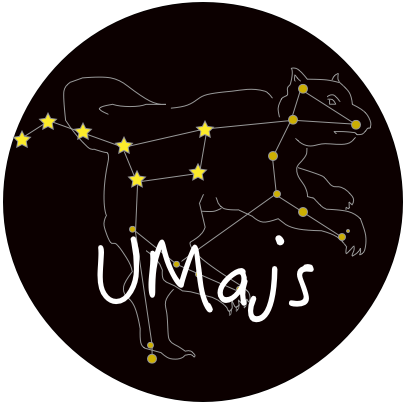

# 框架介绍



`Umajs` 是基于 Koa2 使用 TypeScript 开发、通过装饰器使用大部分功能的 Web 框架。

## 特性

* 基于 Koa2，兼容 middleware
* 装饰器 (Decorator)，代码组织更优雅方便
* 依赖注入 (IOC)，模块依赖不再需要引入和实例化
* 面向切面 (AOP)，基于装饰器的 `Aspect` 可以很方便的对任意方法进行拦截、修改等，并且能将中间件转换成 `Aspect.around` 使用
* 统一返回 (Result)， 让数据返回更便捷清晰
* 自定义装饰器 (createArgDecorator)， 可以快速的扩展参数装饰器，用于参数校验、参数转换、参数聚合等
* 插件、切面形式让中间件(Middleware)使用更优雅
* 高稳定高性能，单元测试覆盖全
* 路由分层，优化路由寻址
* 推荐 TS 开发，开发维护更清晰，对于依赖注入的方法使用也更便捷
* 统一约束和规范

## 特性展示

下面代码展示了以下几个特性：
> 1、通过 `createArgDecorator` 创建参数装饰器，对 `age` 参数进行校验和类型转换
> 
> 2、controller 通过框架提供的 `Result` 便捷的响应数据
> 
> 3、`Aspect` 通过 `around` 方法进行方法的拦截，对方法的 `参数` 进行校验, 对 `返回值` 进行校验/修改

```js
// index.controller.ts
import Method from './method.aspect';
import { AgeCheck } from './ArgDecorator';

@Aspect(Method) // 可以装饰在类上对所有方法进行装饰
export default class extends  BaseController {

    // @Aspect(Method) // 可以装饰在方法上对单一方法进行装饰
    @Path('/hello')
    index(@Query('name') name: string, @AgeCheck('age') age: number ) {
        return Result.json({
            name,
            age,
        });
    }
}
```

```js
// ArgDecorator.ts
export const AgeCheck = createArgDecorator((ctx: IContext, ageKey: string) => {
    let age = ctx.query[ageKey];

    if (age === undefined) return Result.json({
        code: 0,
        msg: '请加上 age 参数',
    });

    age = +age;

    if (Number.isNaN(age) || age < 0 || age > 120) return Result.json({
        code: 0,
        msg: '请传入正确的 age 参数',
    });

    return age;
});
```

```js
// method.aspect.ts
import { IAspect, IProceedJoinPoint } from '@umajs/core';

export default class implements IAspect {
    async around(proceedPoint: IProceedJoinPoint) {
        const { proceed, args } = proceedPoint;

        // 校验参数
        if (args[0] !== 'Umajs') return Result.send('name 必须为 Umajs');

        const result = await proceed(...args);

        if (result.type === 'json') {
            // 为 JSON 返回值加上时间戳
            result.data.time = new Date();
        }

        return result;
    }
}
```

