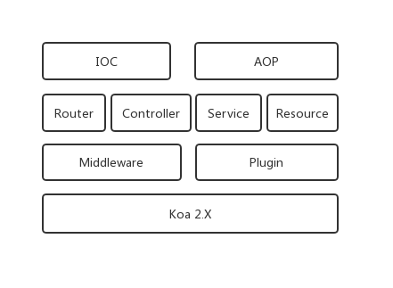
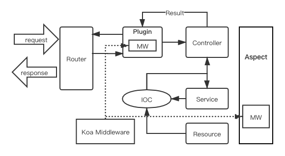

# 框架介绍

Ursa 是基于 Koa2 使用 TypeScript 开发、通过装饰器使用大部分功能的 Web 框架。

## 特性

* 基于 Koa2，兼容 middleware
* 装饰器 (decorator)，代码组织更优雅方便
* 依赖注入 (IOC)，模块依赖不再需要引入和实例化
* 面向切面 (AOP)，基于装饰器的 AOP 可以很方便的使用在各种方法上
* 统一返回 (Result) 让编码更简单清晰
* 自定义装饰器 (createArgDecorator) 可以快速的扩展参数装饰器，用于参数校验、参数转换、参数聚合等。
* 插件、切面形式让中间件使用更优雅
* 高稳定高性能，单元测试覆盖全
* 路由分层，优化路由寻址
* 推荐 TS 开发，开发维护更清晰，对于依赖注入的方法使用也更便捷
* 统一约束和规范

## 架构

## 流程图

> 用户请求达到 router
>
> router 解析请求穿过 plugin 中的中间件，然后到达 controller
>
> controller 可以通过 IOC 调用 service 和 resource
>
> controller、service、resource 等可以通过 AOP 进行切面开发
>
> controller 返回 Result，Ursajs 解析 Result 按 Koa 框架格式返回数据
>