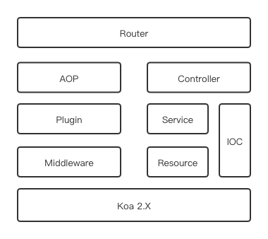

# 框架介绍

Ursa 是基于 Koa2 使用 TypeScript 开发、通过装饰器使用大部分功能的 Web 框架。

## 特性

* 基于 Koa2，兼容 middleware
* 装饰器 (decorator)，代码组织更优雅方便
* 依赖注入 (IOC)，模块依赖不再需要引入和实例化
* 面向切面 (AOP)，基于装饰器的 AOP 可以很方便的使用在各种方法上
* 高稳定高性能，单元测试覆盖全
* 路由分层，优化路由寻址
* 推荐 TS 开发，开发维护更清晰，对于依赖注入的方法使用也更便捷
* 统一约束和规范

## 架构

